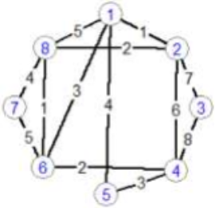

## Задание

1. Написать программу поиска кратчайшие расстояния от заданной вершины (организуется ввод) до всех остальных для графа, используя алгоритмы алгоритмы Дейкстры и Флойда.

2. Написать программу, которая помогает Оле добраться до городов разными способами. Определить наименьшую сумму, которую нужно потратить, чтобы Оля могла навестить каждого из своих друзей и вернуться к себе домой. Предположим Оля живет в городе 1, а друзья живут в других городах (вершины 1,2,3 и тд.). Стоимость билетов из разных городов известна согласно графу варианта задания.

